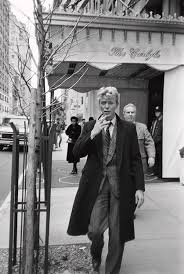
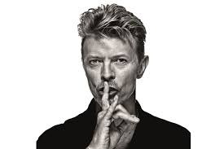
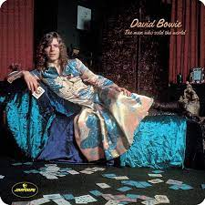
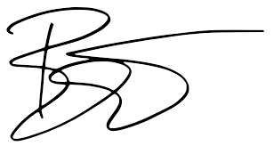

# The man who sold the world

## Artist

David Robert Jones OAL, known professionally as David Bowie, was an English singer-songwriter and actor. A leading figure in the music industry, Bowie is regarded as one of the most influential musicians of the 20th century.



## Album



_Fig.1_

## Release

It was originally released by Mercury Records in the United States on 4 November 1970.

## Lyrics

```text
We passed upon the stair
We spoke of was and when
Although I wasn't there
He said I was his friend
Which came as a surprise
I spoke into his eyes
I thought you died alone
A long long time ago
Oh no, not me
We never lost control
You're face to face
With the man who sold the world
I laughed and shook hand
And made my way back home
I searched for form and land
For years and years I roamed
I gazed a gazeless stare
We walked a million hills
I must have died alone
A long, long time ago
Who knows?
Not me
I never lost control
You're face to face
With the man who sold the world
Who knows?
Not me
We never lost control
You're face to face
With the man who sold the world
Thanks, that was a David Bowie song
What's next?
I didn't screw it up, did I?
Okay, but here's another one I could screw up
What is it?
Am I gonna do this by myself?
Yeah, he should do it by himself
Do it by yourself
Okay, well
I think I'll try it in a different key, I'll try it in a normal key
Yeah
If it sounds bad, these people are just gonna have to wait
Do you have a smoke?
Okay
```


